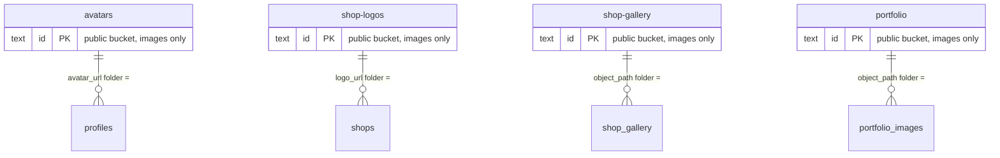

# CutBook — Database ER Diagram

Review-only artifact generated from `supabase/migrations/20260806000000_initial_schema.sql` plus later migrations, including the shop loyalty system (`20260811140000_shop_loyalty.sql`).

- **23 tables** in schema `public`
- Auth identity = `profiles.id` (Clerk `sub`, text)
- Renders in GitHub, VS Code, and Mermaid live editors

```mermaid
erDiagram
    profiles ||--o{ shops : "created_by"
    profiles ||--o{ shop_members : "staff of"
    profiles ||--o{ bookings : "customer"
    profiles |o--o{ bookings : "cancelled_by"
    profiles ||--o{ reviews : "author"
    profiles ||--o{ notifications : "recipient"
    profiles ||--o{ push_tokens : "owns"
    profiles ||--o| settings : "preferences (1:1)"
    profiles |o--o{ audit_log : "actor"
    profiles |o--o{ platform_settings : "updated_by"
    profiles ||--o{ customer_loyalty : "loyalty card per shop"

    shops ||--o{ shop_members : "employs"
    shops ||--o{ services : "offers"
    shops ||--o{ working_hours : "opening hours"
    shops ||--o{ bookings : "receives"
    shops ||--o{ favorites : "favorited"
    shops ||--o{ reviews : "rated"
    shops ||--o{ shop_gallery : "gallery"
    shops ||--o| loyalty_programs : "loyalty program (1:1)"
    shops ||--o{ customer_loyalty : "customer loyalty cards"
    shops ||--o{ loyalty_visits : "awarded visits"

    shop_members ||--o{ staff_services : "qualified for"
    shop_members ||--o{ bookings : "staff"
    shop_members ||--o{ availability : "weekly windows"
    shop_members ||--o{ time_offs : "one-off off"
    shop_members ||--o{ portfolio_images : "portfolio"

    services ||--o{ staff_services : "linked to staff"
    services ||--o{ bookings : "booked"

    bookings ||--o| reviews : "reviewed (0..1)"
    bookings ||--o| loyalty_visits : "awarded (0..1)"
    bookings |o--o{ customer_rewards : "redeemed on"

    loyalty_programs ||--o{ loyalty_milestones : "reward ladder"
    customer_loyalty ||--o{ loyalty_visits : "visit history"
    customer_loyalty ||--o{ customer_rewards : "unlocked rewards"
    loyalty_milestones ||--o{ customer_rewards : "reward per milestone"

    profiles {
        text id PK "Clerk sub"
        text email
        text first_name
        text last_name
        text phone
        text avatar_url "-> avatars bucket"
        text bio
        text city
        text role "customer|barber|owner|admin"
        boolean is_disabled
        boolean onboarding_completed
        timestamptz last_active_at
        timestamptz deleted_at "soft delete"
        timestamptz created_at
        timestamptz updated_at
    }
    shops {
        bigint id PK
        text name
        text slug UK
        text description
        text logo_url "-> shop-logos bucket"
        text address_line1
        text address_line2
        text city
        text state
        text country
        text postal_code
        double latitude
        double longitude
        text phone
        text email
        text website
        text status "pending|approved|suspended"
        boolean is_verified
        boolean is_active
        numeric rating_avg "trigger-maintained"
        integer rating_count
        timestamptz deleted_at "soft delete"
        text created_by FK
        timestamptz created_at
        timestamptz updated_at
    }
    shop_members {
        bigint id PK
        bigint shop_id FK
        text profile_id FK
        text member_role "owner|manager|barber"
        text display_name
        text avatar_url
        timestamptz joined_at
        timestamptz removed_at "soft delete"
        timestamptz created_at
        timestamptz updated_at
    }
    services {
        bigint id PK
        bigint shop_id FK
        text name
        text description
        integer duration_minutes
        integer price_cents
        text category
        boolean is_active
        integer sort_order
        timestamptz created_at
        timestamptz updated_at
    }
    staff_services {
        bigint id PK
        bigint shop_member_id FK
        bigint service_id FK
        integer price_cents "nullable override"
        integer duration_minutes "nullable override"
        boolean is_active
        timestamptz created_at
        timestamptz updated_at
    }
    bookings {
        bigint id PK
        bigint shop_id FK
        text customer_id FK
        bigint staff_id FK
        bigint service_id FK
        text status "pending|confirmed|completed|cancelled|no_show"
        timestamptz starts_at
        timestamptz ends_at
        text service_name "snapshot"
        integer service_price_cents "snapshot"
        integer service_duration_minutes "snapshot"
        text applied_reward_type "nullable; reward snapshot"
        text applied_reward_title "nullable; reward snapshot"
        numeric applied_reward_value "nullable; reward snapshot"
        text note
        text cancel_reason
        timestamptz cancelled_at
        text cancelled_by_id FK "nullable"
        timestamptz created_at
        timestamptz updated_at
    }
    working_hours {
        bigint id PK
        bigint shop_id FK
        smallint day_of_week "0=Sun..6=Sat"
        time opens_at
        time closes_at
        boolean is_closed
        timestamptz created_at
        timestamptz updated_at
    }
    availability {
        bigint id PK
        bigint shop_member_id FK
        smallint day_of_week
        time starts_at
        time ends_at
        timestamptz created_at
        timestamptz updated_at
    }
    time_offs {
        bigint id PK
        bigint shop_member_id FK
        timestamptz starts_at
        timestamptz ends_at
        text reason
        timestamptz created_at
        timestamptz updated_at
    }
    favorites {
        bigint id PK
        text customer_id FK
        bigint shop_id FK
        timestamptz created_at
    }
    reviews {
        bigint id PK
        bigint shop_id FK
        text customer_id FK
        bigint booking_id FK "nullable, SET NULL"
        smallint rating "1..5"
        text comment
        text author_name "trigger-set snapshot"
        text owner_response
        timestamptz responded_at
        text status "pending|published|hidden|removed"
        timestamptz created_at
        timestamptz updated_at
    }
    notifications {
        bigint id PK
        text recipient_id FK
        text type
        text title
        text body
        jsonb data
        timestamptz read_at
        timestamptz created_at
    }
    push_tokens {
        bigint id PK
        text profile_id FK
        text platform "ios|android|web"
        text token UK
        text device_name
        timestamptz last_used_at
        boolean is_active
        timestamptz created_at
        timestamptz updated_at
    }
    shop_gallery {
        bigint id PK
        bigint shop_id FK
        text object_path "-> shop-gallery bucket"
        text caption
        boolean is_cover
        integer sort_order
        timestamptz created_at
    }
    portfolio_images {
        bigint id PK
        bigint shop_member_id FK
        text object_path "-> portfolio bucket"
        text caption
        boolean is_cover
        integer sort_order
        timestamptz created_at
    }
    settings {
        text profile_id PK FK "1:1 with profiles"
        jsonb notification_prefs
        text locale
        boolean marketing_opt_in
        timestamptz updated_at
    }
    audit_log {
        bigint id PK
        text actor_id FK "nullable, SET NULL"
        text action
        text entity_type
        text entity_id
        jsonb before
        jsonb after
        text ip_address
        timestamptz created_at
    }
    platform_settings {
        text key PK
        jsonb value
        text description
        text updated_by FK "nullable, SET NULL"
        timestamptz updated_at
    }
    loyalty_programs {
        bigint id PK
        bigint shop_id FK "unique, 1:1"
        boolean enabled "gates unlocks + redemption + UI"
        timestamptz created_at
        timestamptz updated_at
    }
    loyalty_milestones {
        bigint id PK
        bigint loyalty_program_id FK
        integer visit_count "unique per program"
        text reward_type "percentage_discount|fixed_discount|free_service|custom"
        text reward_title
        text reward_description
        numeric reward_value "nullable; value check per type"
        boolean active
        integer sort_order
        timestamptz created_at
        timestamptz updated_at
    }
    customer_loyalty {
        bigint id PK
        text customer_id FK
        bigint shop_id FK
        integer total_completed_visits ">= 0"
        integer current_streak ">= 0"
        integer best_streak ">= 0"
        timestamptz last_qualifying_visit_at
        timestamptz last_streak_break_at
        timestamptz created_at
        timestamptz updated_at
    }
    loyalty_visits {
        bigint id PK
        bigint customer_loyalty_id FK
        bigint shop_id FK
        bigint booking_id FK "unique -> idempotent award"
        timestamptz awarded_at
        boolean increment_streak
    }
    customer_rewards {
        bigint id PK
        bigint customer_loyalty_id FK
        bigint milestone_id FK
        text status "unlocked|redeemed|expired"
        timestamptz unlocked_at
        timestamptz redeemed_at
        bigint redeemed_booking_id FK "nullable, SET NULL"
        timestamptz expires_at
        timestamptz created_at
        timestamptz updated_at
    }
```

## Storage bucket relationships

Supabase Storage buckets referenced by URL columns / object paths. Path folder rule = key used by RLS policies.



## Cardinality summary

### 1:1
| Left | Right | Via |
|---|---|---|
| `profiles` | `settings` | `settings.profile_id` PK+FK (cascade) |
| `shops` | `loyalty_programs` | `loyalty_programs.shop_id` unique FK (cascade) |

### 1:N
| Parent | Child | FK on child | On delete |
|---|---|---|---|
| `profiles` | `shops` | `created_by` | restrict |
| `profiles` | `shop_members` | `profile_id` | restrict |
| `profiles` | `bookings` (customer) | `customer_id` | restrict |
| `profiles` | `bookings` (cancelled by) | `cancelled_by_id` (nullable) | restrict |
| `profiles` | `reviews` | `customer_id` | restrict |
| `profiles` | `notifications` | `recipient_id` | cascade |
| `profiles` | `push_tokens` | `profile_id` | cascade |
| `profiles` | `audit_log` | `actor_id` (nullable) | set null |
| `profiles` | `platform_settings` | `updated_by` (nullable) | set null |
| `profiles` | `customer_loyalty` | `customer_id` | cascade |
| `shops` | `shop_members` | `shop_id` | restrict |
| `shops` | `services` | `shop_id` | restrict |
| `shops` | `working_hours` | `shop_id` | cascade |
| `shops` | `bookings` | `shop_id` | restrict |
| `shops` | `favorites` | `shop_id` | cascade |
| `shops` | `reviews` | `shop_id` | restrict |
| `shops` | `shop_gallery` | `shop_id` | cascade |
| `shops` | `customer_loyalty` | `shop_id` | cascade |
| `shops` | `loyalty_visits` | `shop_id` | cascade |
| `loyalty_programs` | `loyalty_milestones` | `loyalty_program_id` | cascade |
| `customer_loyalty` | `loyalty_visits` | `customer_loyalty_id` | cascade |
| `customer_loyalty` | `customer_rewards` | `customer_loyalty_id` | cascade |
| `loyalty_milestones` | `customer_rewards` | `milestone_id` | cascade |
| `bookings` | `loyalty_visits` | `booking_id` (unique) | cascade |
| `bookings` | `customer_rewards` (redeemed on) | `redeemed_booking_id` (nullable) | set null |
| `shop_members` | `bookings` (staff) | `staff_id` | restrict |
| `shop_members` | `availability` | `shop_member_id` | cascade |
| `shop_members` | `time_offs` | `shop_member_id` | cascade |
| `shop_members` | `portfolio_images` | `shop_member_id` | cascade |
| `services` | `bookings` | `service_id` | restrict |
| `bookings` | `reviews` | `booking_id` (nullable) | set null |

### N:N (junction tables)
| Left | Right | Junction | Notes |
|---|---|---|---|
| `shop_members` | `services` | `staff_services` | which staff perform which services; optional per-staff price/duration overrides |
| `profiles` | `shops` | `favorites` | unique `(customer_id, shop_id)` |

## Notable constraints

- **`bookings_no_overlap`** — GiST EXCLUDE on `(staff_id, tstzrange(starts_at, ends_at, '[)'))` WHERE `status NOT IN ('cancelled','no_show')` → DB-level double-booking prevention.
- **Unique** — `profiles.phone` (partial, non-null), `shops.slug`, `working_hours(shop_id, day_of_week)`, `availability(shop_member_id, day_of_week, starts_at)`, `favorites(customer_id, shop_id)`, `reviews(shop_id, customer_id)`, `push_tokens.token`, `loyalty_programs.shop_id`, `loyalty_milestones(loyalty_program_id, visit_count)`, `customer_loyalty(customer_id, shop_id)`, `loyalty_visits.booking_id` (idempotent award), `customer_rewards(customer_loyalty_id, milestone_id)`.
- **Soft deletes** — `profiles.deleted_at`, `shops.deleted_at`, `shop_members.removed_at` preserve history while RLS filters active rows.
- **History snapshots** — `bookings` copies service name/price/duration; `reviews.author_name` snapshot via trigger.
- **Loyalty booking snapshot** — `redeem_reward` copies the milestone's reward (type/title/value) onto `bookings.applied_reward_*` at redemption time so shop staff can see it (barbers can't read `customer_rewards` under RLS); backfilled by `20260811160000_backfill_booking_applied_reward.sql`.
- **Aggregates** — `shops.rating_avg` / `rating_count` maintained by triggers.
- **Loyalty integrity** — `customer_loyalty` counters CHECK `>= 0`; `loyalty_milestones.reward_value` CHECK per reward type (percentage_discount 1–100, fixed_discount/free_service 0 or null, custom 0–100000); `customer_rewards.status` CHECK `unlocked|redeemed|expired`; `loyalty_visits.increment_streak` bool.
- **Loyalty writes** — all mutations go through SECURITY DEFINER RPCs (`award_loyalty_visit` trigger-driven; `reconcile_customer_loyalty`; `set_loyalty_program`; `save_loyalty_milestone`; `delete_loyalty_milestone`; `redeem_reward`) granted to `authenticated`; loyalty tables are SELECT-only under RLS (customer sees own cards/rewards, owner sees own shop's data, admin all).
